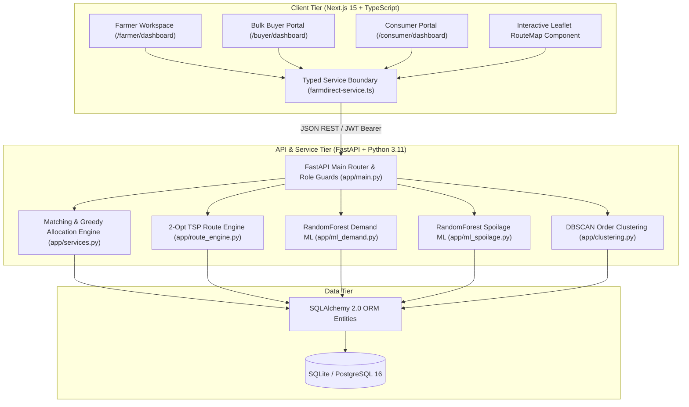
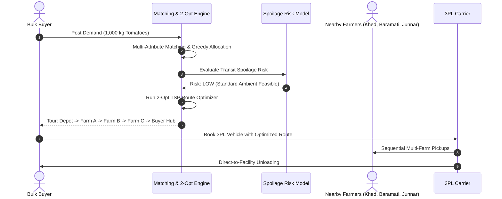
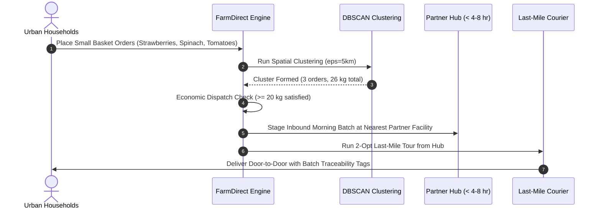

# FarmDirect System Architecture

This document details the architectural design, algorithmic components, and data flows of the FarmDirect agricultural supply chain platform.

---

## 🏛️ High-Level System Architecture

FarmDirect is architected as a modular decoupled system consisting of a Next.js 15 frontend, a FastAPI Python service tier, and a persistent relational database tier.



---

## 🏢 The Asset-Light "No-Warehouse" Model

FarmDirect fundamentally differs from traditional agricultural aggregators:

- **Zero Owned Warehouses:** FarmDirect does not purchase, lease, or operate central storage facilities.
- **Zero Inventory Risk:** Produce ownership remains with the farmer until physical delivery inspection by the buyer or consumer.
- **Zero Owned Fleet:** All transportation is contracted through existing commercial 3PL carriers (mini-trucks, tempos) or local courier delivery networks.
- **Short-Duration Partner Cross-Docking:** For small household deliveries, FarmDirect utilizes existing partner infrastructure (FPO aggregation centers and local cooperative grocery stores) for temporary staging (< 4–8 hours).

```
[Farmer Gate] ──(Consolidated 3PL Inbound)──> [Partner Hub: Max 4-8 hr Staging] ──(Last-Mile Courier)──> [Consumer Doorstep]
```

---

## 🧠 Machine Learning & Algorithmic Engines

FarmDirect integrates specialized algorithms and machine learning models tailored to agricultural supply chain challenges:

| Module | Algorithm / Model | Library | Purpose | Features / Hyperparameters |
| :--- | :--- | :--- | :--- | :--- |
| **Demand Forecasting** | `RandomForestRegressor` | `scikit-learn` | Predicts regional weekly crop demand and active supply gaps | `n_estimators=100`, `max_depth=8`, weather, rainfall, historical arrivals, prices |
| **Spoilage Risk Prediction** | `RandomForestClassifier` | `scikit-learn` | Classifies transit spoilage risk (`LOW` to `CRITICAL`) and evaluates reefer necessity | `n_estimators=100`, transit hours, temperature, humidity, perishability index |
| **Household Clustering** | `DBSCAN` | `scikit-learn` | Groups scattered household orders into dense delivery clusters | Haversine distance, $\epsilon = 5\text{ km}$, $\text{min\_samples} = 2$ |
| **Route Optimization** | Nearest Neighbor + 2-Opt TSP | Native Python & NumPy | Optimizes multi-farm pickup circuits and last-mile doorstep tours | Pairwise Haversine distance matrix, 2-Opt edge swapping, urgency weights |
| **Multi-Attribute Matching** | Deterministic Weighted Scoring | Native Python | Ranks farm candidates across 6 commercial and operational factors | Distance (30%), Price (20%), Quantity (15%), Quality (15%), Readiness (10%), Reliability (10%) |

---

## 🔄 Core Supply Chain Flows

### 1. Bulk Procurement Circuit (2-Opt TSP Multi-Farm Pickup)
For bulk buyer orders (e.g., 1,000 kg), supply is often distributed across multiple smallholder farmers:



---

### 2. Household Delivery & Partner Cross-Docking Flow
For direct-to-consumer micro-orders (1–10 kg):



---

## 🔐 Authentication & Session Security

- **Tokens:** JSON Web Tokens (JWT) signed using `HS256` with 8-hour expiration.
- **Password Security:** Passwords hashed using `bcrypt` (12 rounds) via `passlib`.
- **Authorization:** FastAPI dependency injection guards (`role_guard`) enforce strict role permissions across endpoints (`FARMER`, `FPO`, `BUYER`, `CONSUMER`, `ADMIN`, `LOGISTICS_PARTNER`).
- **Resilient Fallback:** Frontend typed client maintains session storage and fallback mock states for presentation reliability.

---

## 🗄️ Database Architecture

- **Active Engine (Development & Demo):** Persistent SQLite database (`farmdirect-demo.db`) with automatic table creation and realistic regional seeder on startup.
- **Coordinates & Spatial Math:** Latitude and longitude stored as scalar `Float` attributes; spatial calculations executed via spherical Haversine algorithms in Python math and NumPy.
- **Enterprise Target:** PostgreSQL 16 + PostGIS configured in `docker-compose.yml` and `backend/db/schema.sql` for native spatial queries (`ST_DWithin`, `ST_ClusterKMeans`).
