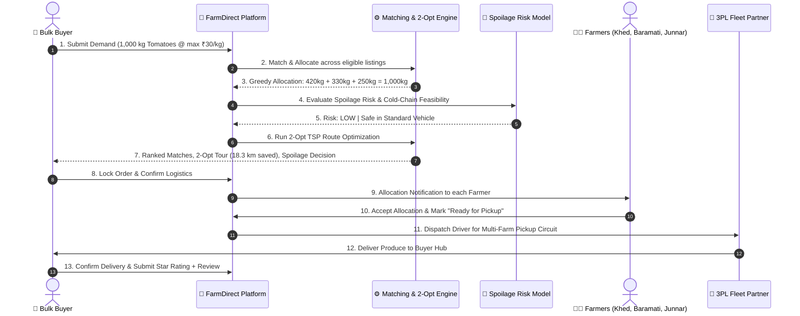
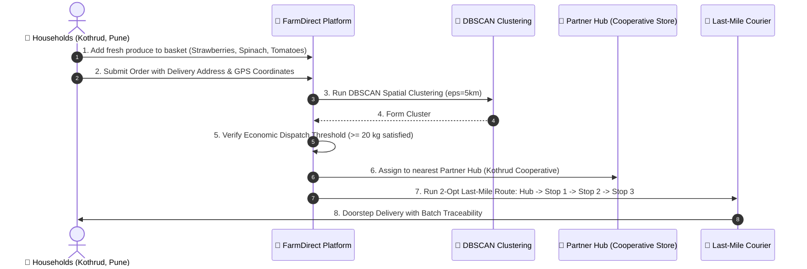

# FarmDirect

> **Direct from Farm. Smarter Matching. Zero-Waste Logistics.**  
> An asset-light agricultural supply chain orchestration platform connecting verified Farmers and Farmer Producer Organizations (FPOs) directly with Bulk Buyers and Household Consumers.

[](https://fastapi.tiangolo.com)
[](https://nextjs.org)
[](https://www.typescriptlang.org/)
[](https://www.python.org/)
[](https://scikit-learn.org/)
[%20%7C%20PostgreSQL%20(Target)-003B57?style=flat-square)](https://sqlite.org/)
[](https://leafletjs.com)

---

## 📌 Problem Statement & SIH Context

**Smart India Hackathon (SIH 2026) | Problem Statement ID: 26033**  
*Title: Intelligent Agricultural Supply Chain & Direct-to-Consumer Market Orchestration*

In conventional Indian agricultural supply chains, smallholder farmers and consumers face structural bottlenecks:

1. **Multi-Tiered Middlemen & Price Erosion:** Intermediaries and unorganized mandi cartels capture 30–50% of the consumer rupee, leaving farmers with minimal margins.
2. **Perishable Crop Spoilage:** Up to 25–40% of fruits and vegetables perish in transit due to uncoordinated transport, lack of temperature-aware routing, and absence of freshness intelligence.
3. **Fragmented Supply vs. Dual Demand:**
   - **Bulk Buyers** (hotels, restaurants, processors) require aggregated volume (1,000+ kg) that single smallholders cannot supply alone.
   - **Household Consumers** require small, multi-crop baskets (2–5 kg), which are uneconomical for individual farm-gate delivery without geographic clustering.
4. **Logistics & Warehousing Inefficiencies:** Traditional logistics rely on centralized, capital-heavy warehouses that introduce dwell time and degrade freshness.
5. **Lack of Traceability & Compliance:** Direct marketing exemptions (such as Maharashtra APMC direct marketing frameworks) and farm batch traceability are rarely accessible to smallholders.

### 💡 The FarmDirect Solution
FarmDirect acts as an **intelligent digital orchestration platform** that balances both bulk institutional demand and clustered household consumer orders against real-time farm supply. It coordinates third-party logistics (3PL) and existing local partner hubs for short-duration cross-docking—**with zero FarmDirect-owned warehouses, trucks, or inventory.**

---

## 🌾 Platform Principles & Asset-Light Architecture

```
┌─────────────────────────────────────────────────────────────────────────────┐
│                    FarmDirect Orchestration Engine                         │
│   (Demand ML • Multi-Attribute Matching • 2-Opt Routing • DBSCAN Clustering)│
└──────────────┬───────────────────────────────┬──────────────────────────────┘
               │                               │
     Direct Produce Supply             Aggregated Demand
               │                               │
   ┌───────────▼───────────┐       ┌───────────▼───────────────────────────┐
   │    Farmers & FPOs     │       │             Buyers & Consumers        │
   │ (Khed, Baramati,      │       ├───────────────────┬───────────────────┤
   │  Junnar Collective)   │       │ Bulk Institutional│ Clustered Small   │
   └───────────┬───────────┘       │ Buyers (1,000+ kg)│ Households (5 kg) │
               │                   └─────────┬─────────┴─────────┬─────────┘
               │                             │                   │
               │   Direct Farm-to-Fork       │                   │
               │   Bulk Circuit (2-Opt TSP)  │                   │
               ├─────────────────────────────┘                   │
               │                                                 │
               │   Aggregated Household Batch                    │
               │   (DBSCAN Geographic Clusters)                  │
               ▼                                                 ▼
   ┌───────────────────────┐                         ┌───────────────────────┐
   │ 3PL Fleet Partner     │                         │ Partner / FPO Hubs    │
   │ (Mini Truck / Reefer) │                         │ (< 4-8 hr Cross-Dock) │
   └───────────────────────┘                         └───────────┬───────────┘
                                                                 │ Last-Mile EV
                                                                 ▼
                                                     ┌───────────────────────┐
                                                     │ Clustered Households  │
                                                     └───────────────────────┘
```

> **CRITICAL ARCHITECTURAL INVARIANT: NO WAREHOUSES, NO TRUCKS, NO INVENTORY**  
> FarmDirect is an asset-light technology orchestrator. FarmDirect **never** owns or leases warehouses, **never** operates proprietary delivery vehicles, and **never** takes balance-sheet inventory risk. All logistics are executed through verified third-party logistics (3PL) carriers, and all cross-docking occurs through existing partner facilities (FPO collection centers and local cooperative stores) for rapid transient sorting (< 4–8 hours).

---

## ✨ Key Features

The platform provides dedicated, role-guarded workspaces for all agricultural supply chain participants:

### 👨‍🌾 Farmers & Farmer Producer Organizations (FPOs)
- **Role-Based Farmer Portal (`/farmer/dashboard`):** Unified dashboard for active produce, incoming allocations, pickup scheduling, and revenue analytics.
- **Produce Management with Perishable Intelligence (`/farmer/produce`):**
  - Crop presets for rapid listing (Strawberries, Spinach, Tomatoes, Onions, Potatoes).
  - Harvest date tracking and declared shelf-life days.
  - Storage condition tagging (`AMBIENT`, `COLD_STORAGE`) and perishability levels (`LOW`, `MEDIUM`, `HIGH`, `CRITICAL`).
  - Automated dynamic **Freshness Index (%)** computation: $\max(0, 100 \cdot (1 - \text{elapsed} / \text{shelf\_life}))$.
- **Real ML Demand Forecasting (`/farmer/dashboard`):** Scikit-learn `RandomForestRegressor` predicts regional crop demand, growth trend percentage, active supply gap, and planting/harvesting recommendations.
- **Food-Waste & Surplus Prevention Alerts:** Identifies aging batches (< 48 hours shelf-life) and high-surplus commodities, recommending dynamic discounting, FPO priority cross-docking, or processing redirection.
- **Allocation Acceptance & Rematching:** Review multi-farm order allocations. If an allocation is cancelled or rejected, FarmDirect automatically triggers backup candidate rematching.
- **Pickup Readiness Dispatch:** Flag produce ready for collection to trigger 3PL driver dispatch.

### 🏢 Bulk Buyers (Institutions, Retailers, Commercial Kitchens)
- **Role-Based Buyer Portal (`/buyer/dashboard`):** Complete procurement console from demand creation to multi-farm delivery.
- **Deterministic Multi-Attribute Matching:** Explainable 6-factor deterministic scoring formula (Distance 30%, Price 20%, Quantity 15%, Quality Grade 15%, Readiness 10%, Reliability 10%).
- **Automated Multi-Farm Bulk Allocation:** Fulfills large volume orders by greedily allocating across top-ranked nearby farms (e.g., 420 kg from Khed + 330 kg from Baramati + 250 kg from Junnar = 1,000 kg).
- **Algorithmic Route Optimization (2-Opt TSP):** Calculates the optimal multi-stop farm pickup circuit, reporting optimized kilometers, travel duration, and fuel cost savings.
- **ML Spoilage Risk & Cold-Chain Decision Engine:**
  - Scikit-learn `RandomForestClassifier` evaluates shipment spoilage risk (`LOW`, `MEDIUM`, `HIGH`, `CRITICAL`).
  - Evaluates shipment transit feasibility (`SAFE`, `WARNING`, `HIGH_RISK`, `UNSAFE`).
  - Vehicle Recommendation: Compares standard transport vs. refrigerated (reefer) transport with freight cost adjustment and protected cargo value metrics.
- **Interactive Multi-Stop Route Map:** Leaflet + OpenStreetMap component showing color-coded stops, stop sequencing numbers, ETAs, and cargo weight pickups.
- **Maharashtra Direct-Sale Compliance Engine:** Automatically verifies state direct-marketing APMC cess exemption eligibility and required documentation (7/12 Land Records, FPO registration).

### 🛒 Household Consumers (Small Quantity Multi-Crop Baskets)
- **Role-Based Consumer Portal (`/consumer/dashboard`):** Direct-to-consumer fresh marketplace for small quantities (1–10 kg).
- **Farm Batch Traceability:** Every listed item displays the source farmer identity, harvest timestamp, verified quality grade, and real-time freshness percentage.
- **Multi-Crop Basket Checkout:** Consumers combine fresh produce into a unified order with delivery address and GPS coordinates.
- **Economic Dispatch Transparency:** Real-time feedback explaining aggregation viability (Minimum cluster dispatch threshold: $\ge 20$ kg or $\ge 3$ orders or $\ge ₹500$ cart value).
- **DBSCAN Geographic Clustering:** Small household orders are automatically grouped into spatial clusters within a 5 km radius using Scikit-learn `DBSCAN` with Haversine distance.
- **Partner Hub Cross-Docking:** Clustered orders are assigned to the nearest partner convenience store or FPO center for short-duration staging (< 4–8 hours).
- **Last-Mile Delivery Route Optimization:** Optimal last-mile delivery routes generated for two-wheeler / EV couriers from the partner hub to individual doorsteps.

---

## 🧠 Real AI/ML Implementation & Algorithmic Methods

FarmDirect uses transparent, verified algorithms and machine learning models. No mock scores, fake AI, or fabricated telemetry are used.

### 1. Demand Forecasting (`backend/app/ml_demand.py`)
- **Model:** `RandomForestRegressor` (`n_estimators=100`, `random_state=42`) from `scikit-learn`.
- **Training Data:** Historical regional agricultural dataset comprising 312 weekly records across Maharashtra districts (Pune, Nashik, Ahmednagar, Satara, Solapur) covering 5 key crops (Strawberries, Spinach, Tomatoes, Onions, Potatoes).
- **Features:** `[crop_encoded, month, week_of_year, rainfall_mm, mandi_arrival_volume_kg, avg_wholesale_price_inr, season_encoded]`.
- **Outputs:** Expected weekly market demand (kg), demand trend percentage, active market supply gap (demand vs. active platform listings), and actionable procurement/farming recommendation.

### 2. Spoilage Risk Prediction (`backend/app/ml_spoilage.py`)
- **Model:** `RandomForestClassifier` (`n_estimators=100`, `random_state=42`) from `scikit-learn`.
- **Training Data:** 480 empirical agricultural post-harvest transit observations across temperature regimes (ambient 22–38°C vs. cold chain 2–6°C), transit durations (1–48 hours), crop perishability categories, and humidity levels.
- **Features:** `[hours_since_harvest, transit_temp_c, humidity_pct, transit_hours, vehicle_is_reefer, perishability_numeric]`.
- **Outputs:**
  - Risk Level: `LOW`, `MEDIUM`, `HIGH`, or `CRITICAL`.
  - Feasibility Status: `SAFE`, `WARNING`, `HIGH_RISK`, or `UNSAFE`.
  - Spoilage Probability percentage.
  - Estimated remaining shelf-life in hours under ambient vs. cold-chain transit.
  - Vehicle Recommendation: `Standard Ambient Vehicle` vs. `Reefer Cold-Chain Truck (+₹800)`.

### 3. Household Order Clustering (`backend/app/clustering.py`)
- **Algorithm:** Density-Based Spatial Clustering of Applications with Noise (`DBSCAN`) from `scikit-learn`.
- **Metric:** `haversine` metric on spherical coordinates (converted from latitude/longitude radians).
- **Hyperparameters:** $\epsilon = 5.0\text{ km} / 6371.0088\text{ rad}$, $\text{min\_samples} = 2$.
- **Functionality:** Aggregates spatially proximate consumer orders into delivery clusters, pairs each cluster with the optimal partner cross-dock hub, and evaluates economic dispatch viability.

### 4. Route Optimization (Bulk Pickup & Last-Mile Delivery) (`backend/app/route_engine.py`)
- **Algorithms:**
  - **Distance Matrix:** Exact pairwise spherical Haversine computation.
  - **Initial Heuristic:** Greedy Nearest Neighbor tour construction.
  - **Local Search:** 2-Opt iterative edge-exchange optimization with urgency weighting for highly perishable cargo.
- **Bulk Multi-Farm Circuit:** Computes the optimal pickup tour: `Depot → Farm 1 → Farm 2 → Farm 3 → Buyer Hub`.
- **Last-Mile Consumer Circuit:** Computes the shortest delivery route from the partner hub across all cluster customer doorsteps.
- **Savings Analysis:** Reports baseline unoptimized distance, optimized distance, distance saved (km), travel time saved (mins), and fuel cost savings (₹ at ₹18.5/km commercial diesel / ₹3.2/km EV rates).

### 5. Multi-Attribute Matching Algorithm (`backend/app/services.py`)
Deterministic, explainable candidate scoring formulation:

$$\text{Overall Score} = 0.30 \cdot S_{\text{dist}} + 0.20 \cdot S_{\text{price}} + 0.15 \cdot S_{\text{qty}} + 0.15 \cdot S_{\text{qual}} + 0.10 \cdot S_{\text{ready}} + 0.10 \cdot S_{\text{rel}}$$

- **Distance ($S_{\text{dist}}$):** $\max(0, 100 \cdot (1 - d / r))$ against buyer radius $r$.
- **Price ($S_{\text{price}}$):** Compares asking price to buyer ceiling budget.
- **Quantity ($S_{\text{qty}}$):** Measures contribution toward total demand.
- **Quality ($S_{\text{qual}}$):** Exact grade match (Grade A $\ge$ Grade B $\ge$ Grade C).
- **Readiness ($S_{\text{ready}}$):** Availability on or before required delivery date.
- **Reliability ($S_{\text{rel}}$):** Historical fulfillment percentage from confirmed past orders.

---

## 🔄 End-to-End Workflows

### 1. Bulk Buyer Workflow (Multi-Farm Procurement)


### 2. Household Consumer Workflow (Clustered Last-Mile)


---

## 🏪 Partner / FPO Short-Duration Cross-Docking Model

To remain strictly **asset-light** and eliminate fixed warehousing overhead, FarmDirect partners with existing rural and peri-urban infrastructure:

| Hub ID | Name | Type | Location | Transit Capacity | Temperature Regime |
| :--- | :--- | :--- | :--- | :--- | :--- |
| `hub-1` | Kothrud Cooperative Hub | Retail Partner Store | Kothrud, Pune | 500 kg / day | Ambient + Cold Chill Room (2–8°C) |
| `hub-2` | Hadapsar FPO Collection Center | FPO Aggregation Point | Hadapsar, Pune | 2,000 kg / day | Ambient Sorting Shed |
| `hub-3` | Wakad Partner Store | Retail Partner Store | Wakad, Pimpri-Chinchwad | 350 kg / day | Ambient + Cold Display (4–10°C) |
| `hub-4` | Viman Nagar Consumer Hub | Urban Sorting Partner | Viman Nagar, Pune | 600 kg / day | Ambient + Small Chiller |

### Operating Rules:
- **Maximum Staging Window:** 4 to 8 hours max dwell time. No overnight warehousing.
- **Inbound:** Consolidated 3PL drop-off from multi-farm morning collections.
- **Cross-Docking:** Quick sorting, basket aggregation, and quality check against farmer batch tags.
- **Outbound:** Immediate dispatch via two-wheeler / EV last-mile delivery routes.

---

## 🛡️ Authentication & Supported User Roles

FarmDirect implements cryptographically signed JSON Web Tokens (`HS256`, 8-hour expiry) with passwords hashed via `bcrypt`.

| Role | Target Persona | Dashboard URL | Capabilities |
| :--- | :--- | :--- | :--- |
| `FARMER` | Smallholder Grower | `/farmer/dashboard` | List produce, monitor ML demand forecast, accept allocations, mark ready, view waste alerts |
| `FPO` | Farmer Producer Org | `/farmer/dashboard` | Aggregate member crop listings, bulk dispatch, view regional demand |
| `BUYER` | Institutional / B2B Buyer | `/buyer/dashboard` | Post demand, 2-Opt route optimization, cold-chain selection, compliance validation, review farmers |
| `CONSUMER` | Household Shopper | `/consumer/dashboard` | Browse fresh marketplace, multi-crop basket checkout, view DBSCAN clusters and batch traceability |
| `ADMIN` | Platform Operator | `/admin/dashboard` | System audit, user verification, compliance configuration |
| `LOGISTICS_PARTNER` | 3PL Fleet Carrier | `/logistics/dashboard` | View assigned pickup tours, accept vehicle dispatches, report milestone tracking |

---

## 🏗️ System Architecture

FarmDirect is organized as a clean decoupled system with a Next.js frontend and a FastAPI backend service boundary:

```
┌────────────────────────────────────────────────────────────────────────┐
│                          CLIENT TIER (Next.js 15)                      │
│                                                                        │
│   ┌─────────────────────┐  ┌────────────────────┐  ┌────────────────┐  │
│   │ Farmer Workspace UI │  │ Buyer Dashboard UI │  │Consumer Portal │  │
│   │ - Freshness & Alerts│  │ - 2-Opt Route Map  │  │- DBSCAN Basket │  │
│   │ - ML Demand Forecast│  │ - Spoilage Decision│  │- Batch Trace   │  │
│   └──────────┬──────────┘  └─────────┬──────────┘  └───────┬────────┘  │
│              │                       │                     │           │
│   ┌──────────▼───────────────────────▼─────────────────────▼────────┐  │
│   │    Typed Service Boundary (lib/farmdirect-service.ts)           │  │
│   │    - JWT Bearer Auth    - Leaflet/OSM Route Map Visualization   │  │
│   └──────────────────────────────────┬──────────────────────────────┘  │
└──────────────────────────────────────┼─────────────────────────────────┘
                                       │ REST API (JSON / Bearer Token)
┌──────────────────────────────────────▼─────────────────────────────────┐
│                         API & SERVICE TIER (FastAPI)                   │
│                                                                        │
│   ┌────────────────────────────────────────────────────────────────┐   │
│   │  Application Routers & Security Middleware (app/main.py)       │   │
│   │  - Role Guard Dependencies      - Pydantic v2 Contract Enforcers│  │
│   └────┬────────────┬─────────────┬────────────┬─────────────┬─────┘   │
│        │            │             │            │             │         │
│   ┌────▼─────┐ ┌────▼──────┐ ┌────▼─────┐ ┌────▼──────┐ ┌────▼──────┐  │
│   │Matching  │ │2-Opt Route│ │Demand ML │ │Spoilage ML│ │DBSCAN     │  │
│   │& Alloc   │ │Engine (TSP│ │(Random   │ │(Random    │ │Cluster    │  │
│   │Engine    │ │+ Savings) │ │ Forest)  │ │ Forest)   │ │Engine     │  │
│   └────┬─────┘ └────┬──────┘ └────┬─────┘ └────┬──────┘ └────┬──────┘  │
│        │            │             │            │             │         │
│   ┌────▼────────────▼─────────────▼────────────▼─────────────▼─────┐   │
│   │              SQLAlchemy 2.0 ORM Entities (app/entities.py)     │   │
│   └──────────────────────────────────┬─────────────────────────────┘   │
└──────────────────────────────────────┼─────────────────────────────────┘
                                       │
┌──────────────────────────────────────▼─────────────────────────────────┐
│                             DATA TIER                                  │
│                                                                        │
│   ┌─────────────────────────────────┐   ┌──────────────────────────┐   │
│   │  SQLite (Active Local Engine)   │   │ PostgreSQL 16 + PostGIS  │   │
│   │  - Persistent farmdirect-demo.db│   │ - Enterprise Target (db/)│   │
│   │  - Automatic Seeding on Startup │   │ - Dockerized Service     │   │
│   │  - Lat/Lng + Haversine Engine   │   │ - GiST Spatial Indexing  │   │
│   └─────────────────────────────────┘   └──────────────────────────┘   │
└────────────────────────────────────────────────────────────────────────┘
```

---

## 🛠️ Tech Stack

### Frontend
- **Framework:** [Next.js 15.0](https://nextjs.org/) (App Router, Client & Server Components)
- **UI & State:** [React 19.0](https://react.dev/), Vanilla CSS Design System with responsive tokens
- **Language:** [TypeScript 5.6](https://www.typescriptlang.org/) (Strict type contracts)
- **Mapping & GIS:** [Leaflet 1.9.4](https://leafletjs.com/) with [OpenStreetMap](https://www.openstreetmap.org/)
- **Icons:** [Lucide React 0.468](https://lucide.dev/)
- **Test Runner:** [Vitest 2.1](https://vitest.dev/)

### Backend
- **Framework:** [FastAPI 0.115+](https://fastapi.tiangolo.com/)
- **ASGI Server:** [Uvicorn 0.30+](https://www.uvicorn.org/)
- **Runtime:** [Python 3.11+](https://www.python.org/)
- **Machine Learning & Math:** [scikit-learn 1.5+](https://scikit-learn.org/), [NumPy 1.26+](https://numpy.org/)
- **Data Validation:** [Pydantic 2.8+](https://docs.pydantic.dev/)
- **ORM & Database:** [SQLAlchemy 2.0+](https://www.sqlalchemy.org/), [Alembic 1.14+](https://alembic.sqlalchemy.org/)
- **Authentication & Security:** PyJWT 2.9+, Passlib with `bcrypt` 1.7+
- **Test Suite:** [Pytest 8.3+](https://docs.pytest.org/), HTTPX 0.28+

---

## 📂 Project Structure

```
FarmDirect/
├── backend/                           # FastAPI backend application
│   ├── app/
│   │   ├── clustering.py              # DBSCAN household order clustering & dispatch logic
│   │   ├── database.py                # SQLAlchemy engine & session factory
│   │   ├── entities.py                # SQLAlchemy ORM database models
│   │   ├── main.py                    # API routes, lifespan & exception handlers
│   │   ├── ml_demand.py               # RandomForestRegressor demand forecasting
│   │   ├── ml_spoilage.py             # RandomForestClassifier perishable spoilage risk
│   │   ├── models.py                  # Pydantic v2 schemas & request/response contracts
│   │   ├── route_engine.py            # Haversine distance matrix & 2-Opt TSP optimization
│   │   ├── security.py                # bcrypt hashing, JWT issuance & role guards
│   │   ├── seed_db.py                 # SQLite/PostgreSQL database seeder
│   │   └── services.py                # Multi-attribute matching, allocation, compliance
│   ├── db/
│   │   └── schema.sql                 # Target PostgreSQL / PostGIS DDL schema
│   ├── migrations/                    # Alembic migrations
│   ├── tests/                         # Backend Pytest test suite
│   │   ├── test_auth_contract.py      # Authentication & token verification tests
│   │   ├── test_enhanced_features.py  # Unit tests for ML, 2-Opt TSP, DBSCAN & Freshness
│   │   ├── test_live_e2e_workflow.py  # End-to-end multi-scenario integration tests
│   │   ├── test_phase4_contracts.py   # API schema & response model contract tests
│   │   ├── test_phase4_e2e.py         # Full API lifecycle simulation
│   │   └── test_services.py           # Matching, greedy allocation & compliance tests
│   ├── alembic.ini
│   ├── Dockerfile
│   └── requirements.txt
├── frontend/                          # Next.js 15 TypeScript application
│   ├── app/
│   │   ├── auth/                      # Authentication page & role selection
│   │   ├── buyer/dashboard/           # Bulk buyer dashboard with 2-Opt route & reefer logic
│   │   ├── consumer/dashboard/        # Household consumer portal with DBSCAN clustering
│   │   ├── farmer/                    # Farmer workspace routes (produce, demand, matches)
│   │   ├── globals.css                # Application CSS styling & tokens
│   │   ├── layout.tsx
│   │   └── page.tsx                   # Landing view rendering AuthPortal
│   ├── components/
│   │   ├── AuthPortal.tsx             # Tabbed login, quick credentials & presentation helper
│   │   ├── ConsumerPortal.tsx         # Household fresh marketplace, basket & cluster view
│   │   ├── FarmerWorkspace.tsx        # Farmer portal, freshness index & ML forecast cards
│   │   ├── ProtectedRoute.tsx         # Client-side session and role guard wrapper
│   │   └── RouteMap.tsx               # Leaflet + OpenStreetMap multi-stop map component
│   ├── lib/
│   │   ├── farmdirect-service.ts      # Typed client API boundary & resilient fallbacks
│   │   └── types.ts                   # Frontend TypeScript interfaces
│   ├── tests/
│   │   └── demo-flow.test.ts          # Vitest frontend tests
│   ├── package.json
│   ├── tsconfig.json
│   └── next.config.ts
├── docker-compose.yml                 # Multi-container orchestration (PostGIS, API, Web)
├── .env.example                       # Root environment variable template
├── API.md                             # REST API reference documentation
├── ARCHITECTURE.md                    # Technical architecture & flow diagrams
├── CHANGELOG.md                       # Version history and upgrade log
├── CONTRIBUTING.md                    # Contribution guidelines
└── README.md                          # Primary platform documentation
```

---

## 🚀 Installation & Setup

Follow these exact steps to run FarmDirect locally on **Windows PowerShell**.

### Prerequisites
- Python 3.11+ installed and added to `PATH`
- Node.js 18+ and npm installed
- Git installed

---

### Step 1: Backend Setup (FastAPI)

```powershell
# Navigate to backend directory
cd c:\Users\Vedant\OneDrive\Documents\FarmDirect\FarmDirect\backend

# Create virtual environment (if not already created)
python -m venv .venv

# Activate virtual environment
.\.venv\Scripts\Activate.ps1

# Upgrade pip and install dependencies
python -m pip install --upgrade pip
pip install -r requirements.txt

# Start the FastAPI backend server
uvicorn app.main:app --reload --port 8000
```

> **Note:** The backend automatically creates and seeds `farmdirect-demo.db` on startup with realistic demo farmers, FPOs, buyers, consumers, partner hubs, and perishable crop listings.

---

### Step 2: Frontend Setup (Next.js)

Open a **second** Windows PowerShell terminal:

```powershell
# Navigate to frontend directory
cd c:\Users\Vedant\OneDrive\Documents\FarmDirect\FarmDirect\frontend

# Install node dependencies
npm install

# Start Next.js development server
npm run dev
```

---

### Step 3: Access Application
- **Web Application:** [http://localhost:3000](http://localhost:3000)
- **Interactive Swagger API Docs:** [http://127.0.0.1:8000/docs](http://127.0.0.1:8000/docs)
- **Backend Health Check:** [http://127.0.0.1:8000/health](http://127.0.0.1:8000/health)

---

## 🔐 Demo Credentials

The platform includes pre-configured identities with presentation shortcuts directly on the login screen:

| Persona / Role | Email | Password | Preset Quick-Fill |
| :--- | :--- | :--- | :--- |
| **Farmer (Khed)** | `farmer@farmdirect.demo` | `farmer123` | Click **"Farmer"** tab on login page |
| **FPO (Baramati)** | `fpo@farmdirect.demo` | `farmer123` | Enter email & password |
| **Bulk Buyer (Pune)** | `buyer@farmdirect.demo` | `buyer123` | Click **"Bulk Buyer"** tab on login page |
| **Household Consumer** | `consumer@farmdirect.demo` | `consumer123` | Click **"Household Consumer"** tab on login page |
| **Admin** | `admin@farmdirect.demo` | `FarmDirect2026!` | Enter email & password |
| **Logistics Partner** | `logistics@farmdirect.demo` | `FarmDirect2026!` | Enter email & password |

---

## 🧪 Testing & Verification

FarmDirect includes test suites verifying all ML models, routing algorithms, business logic, and API contracts:

### Backend Pytest Suite (34 Tests Passing)
Run from the `backend/` directory with the virtual environment activated:

```powershell
cd c:\Users\Vedant\OneDrive\Documents\FarmDirect\FarmDirect\backend
pytest -v
```

**Test Coverage Highlights:**
- `tests/test_enhanced_features.py`: Tests `RandomForestRegressor` demand forecasting, `RandomForestClassifier` spoilage prediction, 2-Opt route savings, `DBSCAN` household clustering, economic dispatch rules, and freshness calculation.
- `tests/test_live_e2e_workflow.py`: Comprehensive live test simulating the 3 judge evaluation scenarios (Bulk 2-Opt procurement, Perishable Spoilage with Reefer toggle, and Consumer DBSCAN clustering with partner cross-docking).
- `tests/test_services.py`: Tests deterministic multi-attribute matching, multi-farm greedy allocation, and Maharashtra compliance rules.
- `tests/test_phase4_contracts.py` & `test_auth_contract.py`: Validates Pydantic v2 schemas and JWT authentication contracts.

### Frontend Vitest Suite (9 Tests Passing)
Run from the `frontend/` directory:

```powershell
cd c:\Users\Vedant\OneDrive\Documents\FarmDirect\FarmDirect\frontend
npm test
```

### Production Build Validation
Verify that the Next.js frontend compiles cleanly:

```powershell
cd c:\Users\Vedant\OneDrive\Documents\FarmDirect\FarmDirect\frontend
npm run build
```

---

## 📡 API Overview

A quick reference of primary platform endpoints (detailed interactive documentation available at `/docs`):

| Domain | Method | Endpoint | Access | Description |
| :--- | :--- | :--- | :--- | :--- |
| **Auth** | `POST` | `/auth/login` | Public | Authenticates user; returns signed JWT bearer token |
| **Produce** | `GET` | `/produce` | Public | Lists active produce with optional `?crop=` filter |
| **Produce** | `POST` | `/produce` | Farmer | Creates produce listing with freshness and shelf-life metadata |
| **Freshness** | `GET` | `/produce/{id}/freshness` | Public | Returns real-time freshness percentage and hours elapsed |
| **Spoilage ML** | `POST` | `/produce/{id}/spoilage-risk` | Public / Buyer | Scikit-learn RF predicts spoilage risk, feasibility, and reefer need |
| **Demand ML** | `GET` | `/forecast/demand` | Public / Farmer | Scikit-learn RF forecasts weekly crop demand and supply gap |
| **Matching** | `POST` | `/matching/run` | Buyer | Deterministic 6-factor matching and multi-farm greedy allocation |
| **Routing** | `POST` | `/logistics/optimize-route` | Buyer | 2-Opt TSP multi-farm pickup circuit with fuel savings |
| **Consumer** | `GET` | `/consumer/products` | Consumer | Catalog of farm-traceable produce available for basket purchase |
| **Consumer** | `POST` | `/consumer/orders` | Consumer | Submits household multi-crop basket order |
| **Clustering** | `POST` | `/consumer/cluster-orders` | Admin / System | Runs DBSCAN ($\epsilon=5\text{ km}$) to cluster orders and verify dispatch |
| **Last-Mile** | `POST` | `/consumer/clusters/{id}/last-mile-route` | System / Courier | 2-Opt route from partner hub across clustered households |
| **Partner Hubs**| `GET` | `/hubs` | Public | Lists available partner cross-dock facilities and staging capacities |
| **Waste Alerts**| `GET` | `/waste-prevention/alerts` | Farmer / Admin | Identifies aging batches (< 48h shelf-life) for discount or priority |
| **Rematching** | `POST` | `/orders/{id}/items/{item_id}/cancel` | Parties | Cancels allocation item and triggers automatic backup rematching |

*(See [API.md](file:///c:/Users/Vedant/OneDrive/Documents/FarmDirect/FarmDirect/API.md) for full endpoint specifications.)*

---

## ⚖️ Implementation Status vs. Future Scope

To ensure absolute academic and competitive integrity, the platform distinguishes between completed features and future scope:

### ✅ Currently Implemented & Verified in Codebase
- [x] Real `RandomForestRegressor` regional demand forecasting with supply gap detection.
- [x] Real `RandomForestClassifier` post-harvest spoilage risk and cold-chain evaluation.
- [x] 2-Opt TSP algorithmic route optimization for multi-farm bulk pickup with fuel savings calculation.
- [x] DBSCAN geographic clustering ($\epsilon=5\text{ km}$) for small household consumer orders.
- [x] Economic dispatch viability verification for aggregated consumer clusters.
- [x] Asset-light partner/FPO cross-docking data models and operational workflows.
- [x] Last-mile courier route optimization from partner hubs to consumer doorsteps.
- [x] Perishable crop intelligence (crop presets, shelf-life, storage conditions, dynamic freshness index).
- [x] Cold-chain recommendation engine with dynamic reefer freight adjustment (+₹800).
- [x] Food waste prevention alerts for aging batches (< 48 hours).
- [x] Farm batch traceability (farmer name, harvest timestamp, freshness %, quality grade).
- [x] Automatic backup rematching upon allocation cancellation.
- [x] Multi-persona web portal (Farmer, Bulk Buyer, Household Consumer).
- [x] Interactive Leaflet + OpenStreetMap multi-stop route visualizer.

### 🔮 Future Scope (Planned Enhancements)
- **PostGIS Native Spatial Indexing:** Migration from in-memory Haversine to native PostgreSQL/PostGIS spatial indexes (`ST_DWithin`, `ST_ClusterKMeans`).
- **IoT Hardware Integration:** Live LoRaWAN/BLE physical sensor telemetry feeds for temperature and humidity during transit.
- **Automated UPI Escrow Settlement:** Integration with NPCI e-RUPI / UPI AutoPay smart escrow contracts for instant release upon delivery inspection.
- **Government Portal Integration:** Real-time synchronization with Agmarknet APMC live mandi rates and e-NAM national marketplace feeds.
- **Automated e-Way Bill Generation:** Programmatic generation of GST e-Way bills and APMC direct-marketing exemption certificates upon order booking.

---

## 👨‍💻 Team & SIH 2026 Participation

*Developed as an academic and innovation project for the Smart India Hackathon (SIH 2026).*  
**Problem Statement:** 26033 — Intelligent Agricultural Supply Chain & Direct-to-Consumer Market Orchestration.

---

## 📄 License

Developed for academic innovation and demonstration purposes under Smart India Hackathon (SIH 2026). An open-source license (such as MIT) will be formally applied upon general public release.
