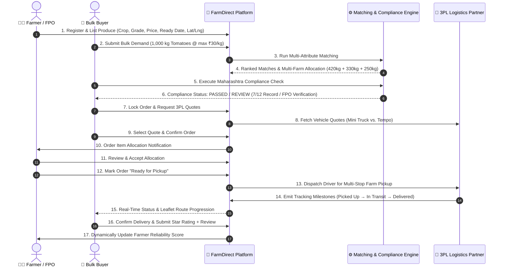
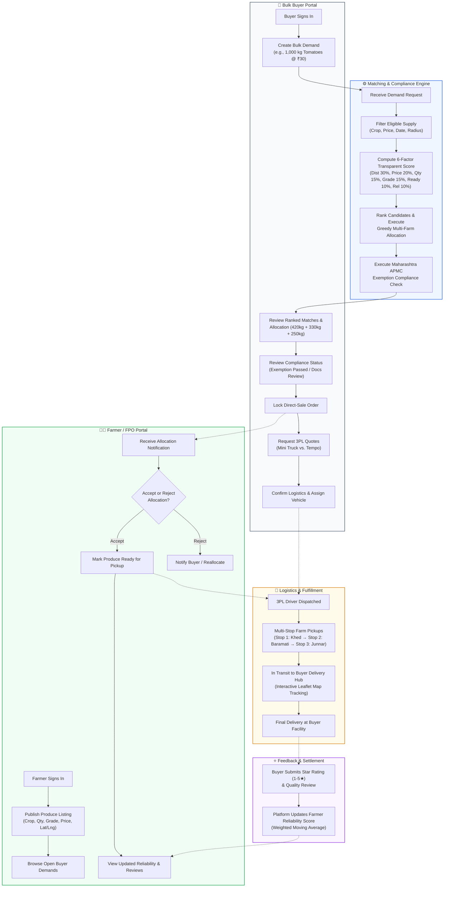

# FarmDirect

> **Direct from Farm. Smarter Matching. Better Prices.**  
> A transparent agricultural marketplace and logistics orchestration platform connecting verified Farmers and Farmer Producer Organizations (FPOs) directly with Bulk Buyers.

[](https://fastapi.tiangolo.com)
[](https://nextjs.org)
[](https://www.typescriptlang.org/)
[](https://www.python.org/)
[%20%7C%20PostgreSQL%20(Target)-003B57?style=flat-square)](https://sqlite.org/)
[](https://leafletjs.com)

---

## 📌 Problem Statement

In conventional agricultural supply chains across India, smallholder farmers and FPOs face severe structural challenges:

1. **Middlemen Dependency & Price Erosion:** Multi-tiered intermediaries and unorganized APMC mandi traders capture up to 30–50% of the final consumer price, leaving farmers with minimal margins.
2. **Fragmented Supply vs. Bulk Demand:** Institutional buyers (hotels, restaurants, retail chains, food processors) require predictable bulk quantities (e.g., 1,000+ kg), but individual smallholders produce in smaller, fragmented batches.
3. **Logistics & Aggregation Inefficiencies:** Coordinating ad-hoc farm pickups across scattered rural locations results in high transport costs, delays, and post-harvest wastage.
4. **Lack of Regulatory & Quality Confidence:** Direct-sale legal compliance (such as Maharashtra APMC direct marketing exemptions) and quality verification create uncertainty for both buyers and producers.
5. **Absence of Accountability:** Unreliable delivery commitments and non-transparent settlement erode trust in direct rural-to-urban commerce.

**FarmDirect solves this by acting as a digital orchestration platform:** it aggregates fragmented farmer supply through a transparent, multi-attribute matching and allocation algorithm, validates statutory direct-sale compliance rules, coordinates third-party logistics (3PL), and tracks orders end-to-end—**without ever taking inventory ownership or purchasing produce.**

---

## 🌾 Overview

**FarmDirect** is an end-to-end, B2B agricultural marketplace and logistics coordination platform developed for academic innovation and competitive demonstration (e.g., Smart India Hackathon).

```
   ┌──────────────────────────────────────────────────────────────┐
   │                        FarmDirect                            │
   │           Marketplace & Orchestration Engine                 │
   └───────────────┬──────────────────────────────┬───────────────┘
                   │                              │
         Direct Produce Supply          Aggregated Demand
                   │                              │
       ┌───────────▼───────────┐      ┌───────────▼───────────┐
       │     Farmers & FPOs    │      │      Bulk Buyers      │
       │  (Khed, Baramati,     │      │ (Institutions, Retail,│
       │   Junnar Collective)  │      │   Commercial Kitchens)│
       └───────────┬───────────┘      └───────────┬───────────┘
                   │                              │
                   └──────────────┬───────────────┘
                                  │
                    ┌─────────────▼─────────────┐
                    │ 3PL Logistics & Tracking  │
                    │   (Mini Truck / Tempo)    │
                    └───────────────────────────┘
```

### Platform Principles
- **Asset-Light Orchestrator:** FarmDirect never buys, warehouses, or takes physical ownership of crops. It matches supply with demand and orchestrates third-party logistics.
- **Transparent Multi-Attribute Matching:** Matches are ranked using an explainable, 6-factor deterministic scoring formula (distance, price, quantity, quality grade, readiness, and past reliability).
- **Automated Supply Aggregation:** If a single farmer cannot fulfill a 1,000 kg demand, the allocation algorithm splits and groups eligible supply across multiple nearby farms.
- **Statutory Compliance Validation:** Built-in verification checks assess transactions against state direct-sale exemptions (e.g., Maharashtra APMC deregulation frameworks) with required documentation.

---

## ✨ Key Features

The platform provides dedicated, role-guarded workspaces for both sides of the agricultural marketplace:

### 👨‍🌾 Farmers & Farmer Producer Organizations (FPOs)
- **Role-Based Farmer Portal (`/farmer/dashboard`):** Unified dashboard showing real-time listings, incoming demand requests, allocation alerts, and performance metrics.
- **Produce Listing Management (`/farmer/produce`):**
  - **Create Listings:** Specify crop, quantity (kg), asking price (₹/kg), quality grade (`A`, `B`, `C`), harvest/ready date, and GPS coordinates.
  - **Edit Listings:** Update quantities, price points, and grades on active produce in real time.
  - **Delete Listings:** Deactivate or delete unsold inventory with automatic cascade updates.
- **Market Demand Intelligence (`/farmer/demand`):** Real-time visibility into open bulk buyer requirements within the farmer’s regional radius.
- **Allocation Acceptance Workflow (`/farmer/matches`):** Review order allocation requests triggered by buyer orders and **Accept** or **Reject** with automated buyer notifications.
- **Pickup Readiness Dispatch (`/farmer/orders`):** Flag allocated produce as ready for pickup to dispatch 3PL logistics and initiate live driver tracking.
- **Farmer Analytics & Reviews (`/farmer/profile`):** Track total listed kilograms, active allocations, completed orders, total earned revenue, fulfillment rate, dynamic reliability percentage, and verified buyer reviews.

### 🏢 Bulk Buyers
- **Role-Based Buyer Portal (`/buyer/dashboard`):** End-to-end procurement console covering demand creation through delivery.
- **Bulk Demand Creation:** Submit requirements by crop, quantity (e.g., 1,000 kg), quality grade requirement, ceiling price (₹/kg), required delivery date, delivery hub location, and search radius (km).
- **Transparent Multi-Attribute Matching:**
  - Ranked recommendations sorted by overall suitability score.
  - Transparent score breakdown with explainable insights across 6 weighted parameters.
- **Multi-Farm Bulk Allocation:** Automatic greedy splitting across eligible farms when demand exceeds single-farm capacity (e.g., 420 kg + 330 kg + 250 kg = 1,000 kg).
- **Maharashtra Direct-Sale Compliance Validation:**
  - Configured compliance assessment evaluating transactions against state agricultural direct-marketing rules.
  - Commodity eligibility verification and identification of mandatory documents (e.g., Farmer 7/12 Land Record extracts, FPO registration certificates).
- **3PL Logistics Selection:** Compare quotes between simulated commercial logistics options (Mini Truck vs. Tempo) with ETA, payload capacities, and fixed quote costs.
- **Interactive Multi-Stop Route Visualization:** Embedded **Leaflet + OpenStreetMap** route display detailing farm pickup sequences and final buyer delivery hubs.
- **Live Order & Milestone Tracking:** 8-stage lifecycle tracker (`CONFIRMED` → `LOGISTICS_REQUESTED` → `VEHICLE_ASSIGNED` → `EN_ROUTE_TO_PICKUP` → `PICKUP_COMPLETED` → `IN_TRANSIT` → `NEAR_DESTINATION` → `DELIVERED`).
- **Rating & Reliability Feedback:** Submit 1–5 star ratings and reviews upon delivery, which automatically updates the farmer's platform reliability score.
- **Buyer Analytics (`/buyer/dashboard`):** Overview of historical spend, total kilograms procured, completed orders, and order status breakdowns.

### ⚙️ Platform & System
- **JWT Authentication with Role Guards:** Cryptographically signed tokens (`HS256`, 8-hour expiry) with passwords hashed via `bcrypt`. Enforces strict endpoint authorization across `FARMER`, `FPO`, `BUYER`, `ADMIN`, and `LOGISTICS_PARTNER`.
- **Database Architecture:**
  - **SQLite Active Engine:** Zero-configuration persistent local database (`farmdirect-demo.db`) seeded with realistic Maharashtra agricultural data. Stores coordinates as scalar floats and calculates distances in application logic.
  - **PostgreSQL / PostGIS Target:** Target enterprise DDL schema (`backend/db/schema.sql`) and containerized profile (`docker-compose.yml`) configured for future spatial query migration.
- **Offline & API Resilience:** Frontend gracefully coordinates with the live backend and maintains fallback demo contracts if the backend is temporarily unreachable.
- **Real-Time Notification & Audit Trails:** Every user registration, listing modification, allocation response, and status transition is recorded in structured audit logs.
- **Interactive OpenAPI Documentation:** Automatically generated Swagger UI available at `/docs`.

---

## 🔄 End-to-End Workflow



### Detailed Execution Steps:
1. **Farmer Registration / Login:** The farmer or FPO logs into the Farmer Workspace.
2. **Produce Listing:** The farmer creates an active produce listing specifying commodity, available quantity, asking price, quality grade, and location.
3. **Buyer Login & Bulk Demand:** An institutional buyer creates a procurement demand for bulk volume with quality and budget parameters.
4. **Multi-Attribute Matching:** FarmDirect scans active listings and computes transparent scores based on distance, price, quantity, quality grade, readiness, and reliability.
5. **Compliance Validation:** The platform executes a state direct-sale compliance check, confirming APMC cess exemption and required producer documentation.
6. **Multi-Farm Allocation:** If no single farm has sufficient quantity, FarmDirect transparently allocates the order across the top-ranked farms (e.g., 420 kg from Khed, 330 kg from Baramati, 250 kg from Junnar).
7. **Farmer Acceptance:** Farmers receive an instant notification in their portal to review and accept or decline their allocated portion.
8. **Logistics Selection:** The buyer compares quotes between 3PL options (Mini Truck vs. Tempo) and books the optimal vehicle.
9. **Pickup Readiness & Dispatch:** The farmer marks the produce as harvested and packed, alerting logistics for farm-gate pickup.
10. **Live Tracking:** Both parties track the order as it progresses through pickup stops to the buyer hub via interactive map route milestones.
11. **Delivery & Feedback:** The buyer inspects the delivery, confirms completion, and submits a 1–5 star rating with comments.
12. **Reliability Update:** The farmer's overall platform reliability percentage updates dynamically based on the verified buyer review.

---

## 🏗️ System Architecture

FarmDirect is architected as a clean modular monolith with a decoupled Next.js frontend and a FastAPI backend service boundary:

```
┌────────────────────────────────────────────────────────────────────────┐
│                          CLIENT TIER (Next.js 15)                      │
│                                                                        │
│   ┌───────────────────────────┐      ┌─────────────────────────────┐   │
│   │   Farmer Workspace UI     │      │     Buyer Dashboard UI      │   │
│   │   - Produce Management    │      │     - Multi-Step Demand     │   │
│   │   - Allocation Response   │      │     - Ranked Match Matrix   │   │
│   │   - Ready for Pickup      │      │     - 3PL & Map Tracker     │   │
│   └─────────────┬─────────────┘      └──────────────┬──────────────┘   │
│                 │                                   │                  │
│   ┌─────────────▼───────────────────────────────────▼──────────────┐   │
│   │    Typed Service Boundary (lib/farmdirect-service.ts)          │   │
│   │    - JWT Session Storage   - Leaflet/OSM RouteMap Integration  │   │
│   └─────────────────────────────────┬──────────────────────────────┘   │
└─────────────────────────────────────┼──────────────────────────────────┘
                                      │ REST API (JSON / Bearer Token)
┌─────────────────────────────────────▼──────────────────────────────────┐
│                         API & SERVICE TIER (FastAPI)                   │
│                                                                        │
│   ┌────────────────────────────────────────────────────────────────┐   │
│   │  FastAPI Application Routers & Middleware (app/main.py)        │   │
│   │  - CORS Middleware             - Role Guard Dependencies       │   │
│   │  - PyJWT & bcrypt Security     - OpenAPI / Swagger Generator   │   │
│   └───────┬──────────────┬───────────────┬──────────────┬──────────┘   │
│           │              │               │              │              │
│   ┌───────▼──────┐┌──────▼──────┐ ┌──────▼──────┐┌──────▼──────────┐   │
│   │   Matching   ││ Allocation  │ │ Compliance  ││   Logistics     │   │
│   │  Scoring Core││ Greedy Split│ │   Validator ││ 3PL Abstraction │   │
│   └───────┬──────┘└──────┬──────┘ └──────┬──────┘└──────┬──────────┘   │
│           │              │               │              │              │
│   ┌───────▼──────────────▼───────────────▼──────────────▼──────────┐   │
│   │              SQLAlchemy 2.0 ORM Entities (app/entities.py)     │   │
│   └─────────────────────────────────┬──────────────────────────────┘   │
└─────────────────────────────────────┼──────────────────────────────────┘
                                      │
┌─────────────────────────────────────▼──────────────────────────────────┐
│                             DATA TIER                                  │
│                                                                        │
│   ┌─────────────────────────────────┐   ┌──────────────────────────┐   │
│   │  SQLite (Active Engine)         │   │ PostgreSQL 16 + PostGIS  │   │
│   │  - File: farmdirect-demo.db     │   │ - Target Schema: db/     │   │
│   │  - Automatic Seeding on Startup │   │ - Containerized Profile  │   │
│   │  - Scalar Lat/Lng + Haversine   │   │ - Spatial GiST Indexes   │   │
│   └─────────────────────────────────┘   └──────────────────────────┘   │
└────────────────────────────────────────────────────────────────────────┘
```

### Matching Algorithm Formulation
The platform evaluates candidates using an explainable, deterministic multi-criteria scoring formulation (implemented in `backend/app/services.py` without black-box ML models):

$$\text{Overall Score} = 0.30 \cdot S_{\text{dist}} + 0.20 \cdot S_{\text{price}} + 0.15 \cdot S_{\text{qty}} + 0.15 \cdot S_{\text{qual}} + 0.10 \cdot S_{\text{ready}} + 0.10 \cdot S_{\text{rel}}$$

- **Distance ($S_{\text{dist}}$):** Calculated using the Haversine spherical distance formula in Python math against the buyer's search radius: $\max(0, 100 \cdot (1 - d / r))$.
- **Price ($S_{\text{price}}$):** Compares asking price against the buyer's ceiling budget: $\max(0, 100 \cdot (1 - (P_{\text{ask}} - P_{\text{max}}) / P_{\text{max}}))$.
- **Quantity ($S_{\text{qty}}$):** Measures contribution towards demand fulfillment: $\min(100, 100 \cdot Q_{\text{listing}} / Q_{\text{demand}})$.
- **Quality Grade ($S_{\text{qual}}$):** Exact grade matching ($100$ if listing grade $\ge$ requested grade; $35$ otherwise).
- **Readiness ($S_{\text{ready}}$):** Evaluates whether produce is harvested and ready on or prior to the required delivery date ($100$ if eligible; $20$ otherwise).
- **Reliability ($S_{\text{rel}}$):** Historical producer reliability rating computed from past confirmed orders (seeded at 90–96%).

**Greedy Allocation:** Matches are sorted in descending order of score. The system iterates through the ranked list and fulfills the requested volume incrementally until the demand is satisfied.

---

## 🛠️ Tech Stack

### Frontend
- **Framework:** [Next.js 15.0](https://nextjs.org/) (App Router, Server & Client Components)
- **UI Library:** [React 19.0](https://react.dev/)
- **Language:** [TypeScript 5.6](https://www.typescriptlang.org/)
- **GIS & Mapping:** [Leaflet 1.9.4](https://leafletjs.com/) with [OpenStreetMap](https://www.openstreetmap.org/)
- **Charts & Visualization:** [Recharts 2.13](https://recharts.org/)
- **Icons:** [Lucide React 0.468](https://lucide.dev/)
- **Test Runner:** [Vitest 2.1](https://vitest.dev/)

### Backend
- **Framework:** [FastAPI 0.115+](https://fastapi.tiangolo.com/)
- **ASGI Server:** [Uvicorn 0.30+](https://www.uvicorn.org/)
- **Runtime:** [Python 3.11+](https://www.python.org/) (`python:3.12-slim` in Docker)
- **Data Validation:** [Pydantic 2.8+](https://docs.pydantic.dev/) & `email-validator`
- **ORM:** [SQLAlchemy 2.0+](https://www.sqlalchemy.org/)
- **Database Migrations:** [Alembic 1.14+](https://alembic.sqlalchemy.org/)
- **Test Suite:** [Pytest 8.3+](https://docs.pytest.org/) & [HTTPX 0.28+](https://www.python-httpx.org/)
- **Prospective ML Library:** `scikit-learn>=1.5.0` (included in `requirements.txt` for future predictive modeling; core matching currently runs deterministic Python math)

### Database & Security
- **Active Database (Development & Demo):** SQLite (`farmdirect-demo.db`) with scalar Float coordinate columns and Python Haversine calculations.
- **Enterprise Database Target:** PostgreSQL 16 with PostGIS 3.4 (`docker-compose.yml` service and `backend/db/schema.sql`).
- **Session Tokens:** PyJWT 2.9+ (`HS256` token encoding & decoding, 8-hour expiration).
- **Password Hashing:** Passlib with `bcrypt` 1.7+.
- **Access Control:** Role guards guarding routes for `FARMER`, `FPO`, `BUYER`, `ADMIN`, and `LOGISTICS_PARTNER`.

### Infrastructure
- **Containerization:** Docker (`python:3.12-slim` & `node:22-alpine`) and Docker Compose.

---

## 📂 Project Structure

```
FarmDirect/
├── backend/                           # FastAPI backend application
│   ├── app/
│   │   ├── database.py                # Engine, sessionmaker, and Base declarative model
│   │   ├── entities.py                # SQLAlchemy ORM mapped entities
│   │   ├── models.py                  # Pydantic v2 schemas and API response contracts
│   │   ├── security.py                # bcrypt hashing, JWT issuance & role guards
│   │   ├── seed.py                    # In-memory candidate listings for scoring tests
│   │   ├── seed_db.py                 # SQLite/Postgres demo database seeder
│   │   ├── services.py                # Scoring, greedy allocation, compliance, logistics
│   │   └── main.py                    # API router definitions & startup lifecycle
│   ├── db/
│   │   └── schema.sql                 # Production PostgreSQL/PostGIS DDL schema
│   ├── migrations/                    # Alembic migration environment
│   │   ├── env.py
│   │   └── versions/
│   │       └── 001_initial.py
│   ├── tests/                         # Pytest test suite
│   │   ├── test_auth_contract.py
│   │   ├── test_services.py
│   │   ├── test_phase4_contracts.py
│   │   ├── test_phase4_e2e.py
│   │   └── test_live_e2e_workflow.py
│   ├── alembic.ini
│   ├── Dockerfile
│   └── requirements.txt
├── frontend/                          # Next.js 15 TypeScript frontend
│   ├── app/
│   │   ├── auth/                      # Dedicated authentication route
│   │   ├── buyer/
│   │   │   └── dashboard/page.tsx     # Bulk buyer procurement portal
│   │   ├── farmer/                    # Farmer workspace sub-routes
│   │   │   ├── dashboard/page.tsx
│   │   │   ├── demand/page.tsx
│   │   │   ├── matches/page.tsx
│   │   │   ├── orders/page.tsx
│   │   │   ├── produce/page.tsx
│   │   │   └── profile/page.tsx
│   │   ├── globals.css                # Custom CSS design system
│   │   ├── layout.tsx
│   │   └── page.tsx                   # Landing view rendering AuthPortal
│   ├── components/
│   │   ├── AuthPortal.tsx             # Tabbed login, quick credentials & presentation helper
│   │   ├── FarmerWorkspace.tsx        # Comprehensive farmer portal and listing manager
│   │   ├── ProtectedRoute.tsx         # Client-side session and role guard wrapper
│   │   └── RouteMap.tsx               # Leaflet + OpenStreetMap multi-stop map component
│   ├── lib/
│   │   ├── farmdirect-service.ts      # Typed client-side API boundary and demo fallback
│   │   └── types.ts                   # Frontend TypeScript interfaces
│   ├── tests/
│   │   └── demo-flow.test.ts          # Vitest frontend contract and workflow tests
│   ├── Dockerfile
│   ├── package.json
│   ├── tsconfig.json
│   └── next.config.ts
├── outputs/                           # Standalone prototype and documentation
│   ├── index.html                     # Self-contained browser prototype
│   ├── README.md
│   └── UPGRADE-NOTES.md
├── docker-compose.yml                 # Multi-container orchestration (PostGIS, Backend, Frontend)
├── .env.example                       # Root environment variable template
└── README.md                          # Project documentation
```

---

## 🚀 Installation & Setup

Follow these exact commands to run FarmDirect locally on **Windows PowerShell**.

### Prerequisites
- Python 3.11+ installed and added to `PATH`
- Node.js 18+ and npm installed
- Git installed

---

### Method 1: Local Development (Zero-Setup SQLite)

#### 1. Backend Setup
Open a Windows PowerShell terminal:

```powershell
# Navigate to the backend directory
cd c:\Users\Vedant\OneDrive\Documents\FarmDirect\FarmDirect\backend

# Create a Python virtual environment
python -m venv .venv

# Activate the virtual environment
.\.venv\Scripts\Activate.ps1

# Upgrade pip and install required dependencies
python -m pip install --upgrade pip
pip install -r requirements.txt

# Run Alembic migrations (initializes SQLite schema)
alembic upgrade head

# Start the FastAPI backend server
uvicorn app.main:app --reload --port 8000
```

> **Note:** On startup, the backend automatically seeds `farmdirect-demo.db` with demo farmers, listings, demand requests, and historical orders.

#### 2. Frontend Setup
Open a **second** Windows PowerShell terminal:

```powershell
# Navigate to the frontend directory
cd c:\Users\Vedant\OneDrive\Documents\FarmDirect\FarmDirect\frontend

# Install node dependencies
npm install

# Start the Next.js development server
npm run dev
```

#### 3. Access the Application
- **Frontend Web Application:** [http://localhost:3000](http://localhost:3000)
- **Backend API Base:** [http://127.0.0.1:8000](http://127.0.0.1:8000)
- **Interactive Swagger Documentation:** [http://127.0.0.1:8000/docs](http://127.0.0.1:8000/docs)
- **Backend Health Check:** [http://127.0.0.1:8000/health](http://127.0.0.1:8000/health)

---

### Method 2: Docker Compose (With PostGIS Container)

To launch the full containerized stack including PostgreSQL with PostGIS:

```powershell
cd c:\Users\Vedant\OneDrive\Documents\FarmDirect\FarmDirect
docker compose up --build
```

---

## 🔐 Demo Credentials

The platform includes pre-configured demo identities in `seed_db.py` with presentation shortcuts embedded directly into the login screen:

| Role | Portal / Persona | User ID / Login Alias | Email | Password |
| :--- | :--- | :--- | :--- | :--- |
| **Farmer** | Khed Farmer Group (Demo) | `farmer` *(or `farmer-1`)* | `farmer@farmdirect.demo` | `farmer123` *(or `FarmDirect2026!`)* |
| **FPO** | Baramati FPO (Demo) | `fpo` *(or `fpo-1`)* | `fpo@farmdirect.demo` | `farmer123` *(or `FarmDirect2026!`)* |
| **Farmer** | Junnar Growers Collective (Demo) | `farmer-3` | `junnar@farmdirect.demo` | `farmer123` *(or `FarmDirect2026!`)* |
| **Bulk Buyer** | Pune Institutional Buyer (Demo) | `buyer` *(or `buyer-demo`)* | `buyer@farmdirect.demo` | `buyer123` *(or `FarmDirect2026!`)* |
| **Admin** | FarmDirect Admin (Demo) | `admin` *(or `admin-demo`)* | `admin@farmdirect.demo` | `FarmDirect2026!` |
| **Logistics** | Demo Logistics Partner | `logistics` *(or `logistics-demo`)* | `logistics@farmdirect.demo` | `FarmDirect2026!` |

> 💡 **Quick Presentation Tip:** On the login page ([http://localhost:3000](http://localhost:3000)), click **Presentation Access Credentials** to auto-fill verified Farmer or Buyer credentials with a single click.

---

## 🧪 Testing

FarmDirect includes test suites across backend business logic and frontend contracts:

### Backend Tests (Pytest)
Run from the `backend/` directory with the virtual environment activated:

```powershell
cd c:\Users\Vedant\OneDrive\Documents\FarmDirect\FarmDirect\backend
pytest -v
```

**Verified Test Coverage:**
- `tests/test_services.py`: Verifies transparent ranking math, multi-farm bulk splitting (1,000 kg demand fulfilled by 3 farms), Maharashtra compliance rule outcomes, and forecast labeling.
- `tests/test_auth_contract.py`: Validates password hashing and JWT token issuance contracts.
- `tests/test_phase4_contracts.py`: Validates Pydantic response models and API schemas.
- `tests/test_phase4_e2e.py`: Full API lifecycle test simulating registration, listing creation, demand matching, order creation, and status transitions using FastAPI's `TestClient`.

### Frontend Tests (Vitest)
Run from the `frontend/` directory:

```powershell
cd c:\Users\Vedant\OneDrive\Documents\FarmDirect\FarmDirect\frontend
npm test
```

**Verified Test Coverage:**
- `tests/demo-flow.test.ts`: Verifies exact multi-farm allocation math (420 kg + 330 kg + 250 kg = 1,000 kg), explainable matching score breakdowns, compliance check results, 3PL quote comparisons, and route tracking stops.

### Production Build Validation
To verify that the Next.js frontend builds cleanly for production:

```powershell
cd c:\Users\Vedant\OneDrive\Documents\FarmDirect\FarmDirect\frontend
npm run build
```

---

## 📡 API Overview

The FastAPI backend exposes modular REST endpoints documented interactively at `/docs`:

| Domain | Method | Endpoint | Access / Guard | Description |
| :--- | :--- | :--- | :--- | :--- |
| **System** | `GET` | `/health` | Public | Checks database connectivity, total users, listings, and order counts. |
| **Authentication** | `POST` | `/auth/register` | Public | Registers a new user (`FARMER`, `FPO`, `BUYER`, `ADMIN`, `LOGISTICS_PARTNER`). |
| **Authentication** | `POST` | `/auth/login` | Public | Authenticates via email, ID, or alias; returns signed JWT bearer token. |
| **Authentication** | `GET` | `/auth/me` | Authenticated | Retrieves current authenticated session profile and reliability rating. |
| **Produce Listings** | `GET` | `/produce` | Public | Lists active produce with optional `?crop=` keyword filter. |
| **Produce Listings** | `POST` | `/produce` | `FARMER`, `FPO` | Creates a new crop listing with GPS coordinates, grade, and price. |
| **Produce Listings** | `PUT` | `/produce/{id}` | `FARMER`, `ADMIN` | Updates price, quantity, quality grade, or status of an existing listing. |
| **Produce Listings** | `DELETE` | `/produce/{id}` | `FARMER`, `ADMIN` | Deletes an owned produce listing. |
| **Farmer Operations** | `GET` | `/farmers/me/listings` | `FARMER`, `FPO` | Fetches all listings belonging to the authenticated farmer. |
| **Farmer Operations** | `GET` | `/farmers/me/demands` | `FARMER`, `FPO` | Fetches open market demand requests from bulk buyers. |
| **Farmer Operations** | `GET` | `/farmers/me/orders` | `FARMER`, `FPO` | Retrieves incoming order allocations with pickup time windows. |
| **Farmer Operations** | `POST` | `/farmers/me/allocations/{id}/respond` | `FARMER`, `FPO` | Accepts or rejects a specific order item allocation. |
| **Farmer Operations** | `POST` | `/farmers/me/orders/{id}/ready` | `FARMER`, `FPO` | Marks produce ready for pickup; dispatches logistics partner. |
| **Buyer Demand** | `POST` | `/demands` | `BUYER` | Creates a new bulk demand requirement in the system. |
| **Matching Engine** | `POST` | `/matching/run` | Public / Buyer | Executes multi-attribute transparent scoring and greedy bulk allocation. |
| **Compliance** | `POST` | `/compliance/check` | Public / Buyer | Evaluates state direct-sale rules (e.g., Maharashtra APMC deregulation). |
| **Orders** | `POST` | `/orders` | `BUYER` | Locks allocations into a confirmed order and notifies assigned farmers. |
| **Orders** | `GET` | `/buyers/me/orders` | `BUYER`, `ADMIN` | Lists historical and active orders placed by the current buyer. |
| **Orders** | `GET` | `/orders/{order_id}` | Parties / Admin | Retrieves comprehensive order details, allocated items, and vehicle info. |
| **Orders** | `PATCH`| `/orders/{order_id}/status` | Authenticated | Transitions order through lifecycle states (`CONFIRMED` to `DELIVERED`). |
| **Logistics** | `POST` | `/logistics/request` | Public / Buyer | Generates simulated 3PL quote options (Mini Truck vs. Tempo) for order weight. |
| **Logistics** | `POST` | `/logistics/{id}/select` | Public / Buyer | Selects a preferred 3PL quote and assigns vehicle to the order. |
| **Tracking** | `GET` | `/tracking/{order_id}` | Public | Retrieves milestone progress, percentage, and multi-stop route stops. |
| **Tracking** | `POST` | `/tracking/{order_id}/next` | Public / Demo | Advances tracking milestone to next logical step for live demonstration. |
| **Market Intelligence** | `GET` | `/forecast/{crop}/{region}` | Public | Returns prototype demand/supply forecast data (explicitly labeled demo). |
| **Ratings & Feedback**| `POST` | `/ratings` | `BUYER` | Submits 1–5 star score and comment; dynamically updates farmer reliability. |
| **Analytics** | `GET` | `/analytics/farmer` | `FARMER`, `FPO` | Aggregates farmer revenue, fulfillment rate, listings count, and ratings. |
| **Analytics** | `GET` | `/analytics/buyer` | `BUYER` | Aggregates buyer spend, total volume procured, and order status counts. |
| **Notifications** | `GET` | `/notifications` | Authenticated | Retrieves system alerts, allocation requests, and status changes. |
| **Notifications** | `PATCH`| `/notifications/{id}/read` | Authenticated | Marks a specific notification as read. |

---

## 🗺️ FarmDirect Workflow Diagram



---

## 🎯 Problem Solved

FarmDirect directly targets structural bottlenecks in the agricultural value chain:

- **Reduces Unnecessary Intermediaries:** By connecting institutional buyers directly with local farmers and FPOs, FarmDirect allows buyers to procure at competitive rates while returning higher net realizations directly to growers.
- **Enables Transparent Farmer Price Discovery:** Farmers set their own asking prices, avoiding distress sales driven by unorganized mandi cartels.
- **Aggregates Fragmented Supply for Bulk Demand:** Institutional buyers requiring bulk volume (e.g., 1,000+ kg) can procure through a single platform, with automated allocation splitting across multiple smallholders.
- **Optimizes Rural-to-Urban Logistics:** Instead of individual farmers arranging isolated, expensive transport, FarmDirect consolidates pickup routes for third-party logistics (3PL) partners, reducing empty return trips and transit loss.
- **Establishes Trust Through Verifiable Reliability:** Dynamic reliability ratings based on confirmed order fulfillment incentivize quality grading and timely dispatch.
- **Ensures Regulatory Compliance:** Automated rule assessment under statutory direct-marketing frameworks (such as Maharashtra's APMC exemption notifications) provides institutional procurement teams with legal confidence.

---

## 🔮 Future Scope

> **Note:** The items below represent planned future architectural enhancements and are not part of the current prototype implementation.

- **PostGIS Native Spatial Indexing & Geofencing:** Implementing native spatial SQL queries (`ST_DWithin`, `ST_ClusterKMeans`) and automated GPS geofencing triggers as 3PL vehicles approach farm pickup locations.
- **Escrow-Based Smart Contract Settlements:** Integrating UPI AutoPay / e-RUPI smart escrow accounts that hold buyer funds and disburse payments directly to farmer bank accounts upon verified delivery inspection.
- **Automated Vehicle Route Optimization:** Integrating Google OR-Tools or Open Source Routing Machine (OSRM) to solve the Capacitated Vehicle Routing Problem with Time Windows (CVRPTW) for multi-farm collections.
- **Machine Learning Yield & Price Forecasting:** Ingesting real-time Agmarknet and e-NAM API market rate feeds combined with satellite weather data to train production ML forecasting models (using `scikit-learn`).
- **IoT Cold-Chain Monitoring:** Integrating LoRaWAN and BLE temperature and humidity sensor telemetry into the live tracking timeline for perishable crop shipments.
- **Automated e-Way Bill & Tax Invoicing:** Programmatic generation of GST e-Way bills and APMC direct-marketing exemption certificates upon order confirmation.

---

## 👨‍💻 Team

*Developed as an academic and innovation project for the Smart India Hackathon (SIH).*

| Role | Details |
| :--- | :--- |
| **Project Lead & Full-Stack Development** | *FarmDirect Innovation Team* |
| **Institution / Organization** | *Academic Innovation Initiative* |
| **Repository** | [GitHub - FarmDirect](https://github.com/vedantm77/FarmDirect) |

---

## 📄 License

This project is developed as an academic and innovation prototype for demonstration purposes (e.g., Smart India Hackathon). An open-source license (such as MIT) will be formally applied upon general public release.
